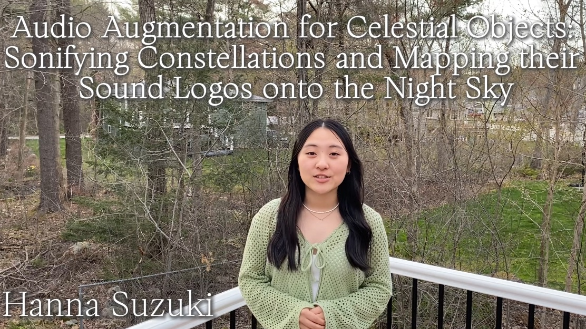
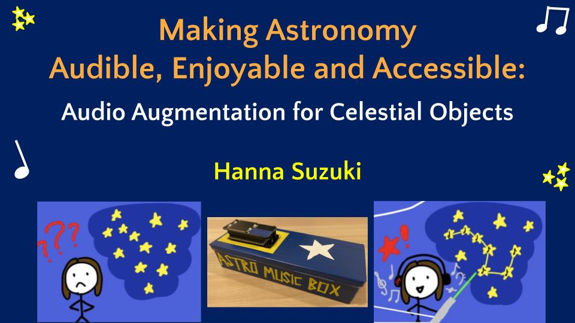
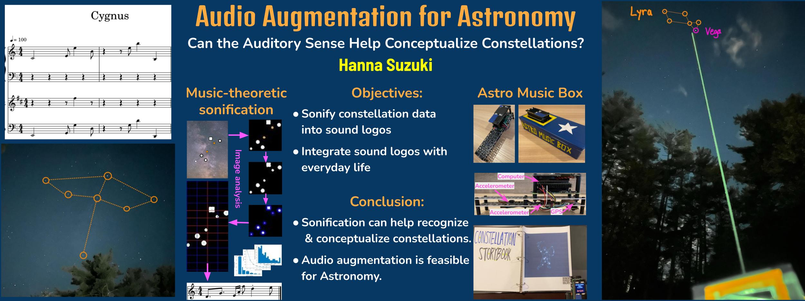
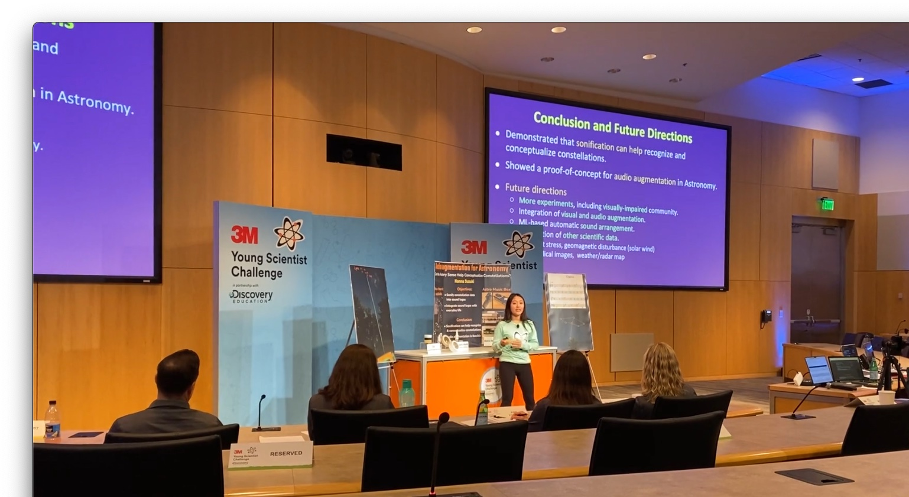

## Audio Augmentation for Celestial Objects: Sonifying Constellations and Mapping their Sound Logos onto the Night Sky

  
  

  [ <a href="https://drive.google.com/file/d/1Iap7OLXJPbDNmZsfVBcFuCyVxrbguQa4/view?usp=sharing">2-minute initial/entry presentation</a> | 
    <a href="https://docs.google.com/presentation/d/1892Bazc3ocrckrqO_nUQWD-xcB7j0g_qz1vmTglqWvQ/edit?usp=sharing">Final 5-minute presentation slides</a> ]

  

  [ <a href="https://docs.google.com/presentation/d/16AtE8gw5tq7u7Ps_pym1cnvDdeaENCeNRaGiDVy72ZU/edit?usp=sharing">Final poster presentation</a> ]

I worked on augmented reality (AR) for Astronomy in the [2024 3M Young Scientist Challenge](https://youngscientistlab.com/). My project focused on audio augmentation for Astronomy, translated 6-dimensional constellation data to short music, or “sound logos," with a music-theoretic algorithm and implemented the algorithm as a handheld device. When the device is pointed to the night sky, it searches a constellation in its direction and plays a sound logo for it. 

I was selected as [one of 10 national finalists](https://youngscientistlab.com/annual-challenge/finalists-mentors-judges/finalists/hanna-suzuki-2024). In October 2024, I gave [the final project presentation](https://docs.google.com/presentation/d/1892Bazc3ocrckrqO_nUQWD-xcB7j0g_qz1vmTglqWvQ/edit?usp=sharing) at 3M's headquarters in St. Paul, MN. 

  

### Project Description:

Augmented reality (AR) often means visual augmentation, which overlays visual, digital effects on the physical environment. On the other hand, audio augmentation is under-explored and considered a secondary factor in many AR applications. For example, there are many powerful, beautiful and useful AR applications for Astronomy, but none of them performs audio augmentation. 

This project studies audio augmentation for Astronomy by sonifying astronomical data, particularly constellation data, into short music, or “sound logo.” The proposed sonification algorithm uses several concepts, methods and notations in music theory to synthesize a sound logo from 6-dimensional constellation data (a 2-dimensional image with extra dimensions for constellation size, brightness and colors of stars, and dark sky objects). It extracts 6 key features from a constellation and translates them to 5 musical elements (melody, rhythm, harmony, dynamics and articulation) through image and data analysis. Currently, a constellation is sonified with three instrument sounds: piano, cello, and trumpet. Experimental results show that sonification allows learners to clearly understand and recognize constellations.

This constellation sonifier is implemented as a handheld device. Its camera module can scan AR markers printed on educational materials (e.g., picture books and encyclopedias) to extract a constellation name from each marker and play a sound logo for the detected constellation. The device also implements real-time constellation search, which identifies a constellation viewable at the location of the device and in its orientation (pitch and heading angles). It obtains location information with a GPS sensor, and estimates orientation through trigonometric calculation with accelerometer and magnetometer data. When the device is pointed to the night sky, it searches a constellation in its direction and plays a sound logo for it. This way, the user of the device can experience constellations with the music sonified from themselves while stargazing.

The goals of this project are to make AR experience more immersive and effective for Astronomy education and help Astronomy learners (even toddlers) better conceptualize astronomical data and facts with the auditory sense.

